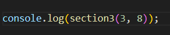

## How to RUN
1. Open up your terminal.
2. Type in `node index.js` while under the Algorithm folder.
3. The output should be displayed on the terminal 

## How to Test
1. To change the value of `l` and `t` go to the `index.js` file.
2. Scroll down until you see the `section3()` function.

3. Type in a new first parameter to change the `l` value into the function.
4. Type in a new second parameter to change the `t` value into the function.
5. Go back to the terminal.
6. Type in `node index.js` while under the Algorithm folder.
7. The output should be displayed on the terminal.